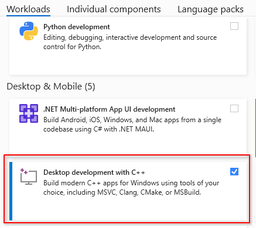
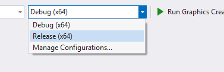
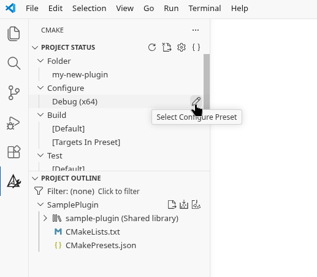

# Plugin Development

Plugins allow you to extend the functionality Graphics Creator with your own features. Currently, only custom effects are possible with the plugin API, but more is planned.

Development of plugins is currently only supported on Windows and Linux.

## Setup

If on Windows, then using Visual Studio is recommended. On Linux, VS Code and CLion are recommended.

Before continuing, if starting on a new plugin, you have to download the plugin sample. This is available on the GitHub release page in "Assets". Then extract it into a new folder with the name of your plugin.

### Windows: Visual Studio

#### 1. Install workload

In the Visual Studio installer program, make sure C++ development is checked and installed.



#### 2. Open folder

In the Visual Studio main splash screen, select "Open a local folder", and select your new plugin folder. The plugin folder should contain the "CMakeLists.txt" file at the root of the folder.


#### 3. Run

Once the project has been opened, you are now ready to develop your plugin. Click on "Run Graphics Creator Plugin" at the top to begin building and debugging.


#### 4. Test in release

In case you want to test or build in release mode, which is recommended for distribution, switch the target next to the run button.



### Linux: VS Code

#### 1. Install libraries

To be able to build, you may have to install certain libraries:

```bash
# Fedora
sudo dnf install libstdc++-static
```

#### 2. Open folder

You may have to trust the folder once opening it in Visual Studio Code.

#### 3. Install extensions

Install these recommended extensions for development:

- **C/C++ by Microsoft:** Used for debugging
- **CMake Tools by Microsoft:** Used for setting up targets
- **clangd by LLVM:** Used for code navigation


In case clangd asks to install the language server, click install:


#### 4. Run

Press <kbd>F5</kbd> or at the bottom the play button to run the project. You may have to open the plugin.cpp file first. After configuring or building you may have to restart VS Code.


#### 5. Test in release

In case you want to test or build in release mode, which is recommended for distribution, you have to switch the target to release.

To do this, open the CMake tab on the navigation bar, then under "Configure" under "Project Status", click the edit icon and switch it to release. There you can also switch it back to debug.



### Linux: CLion
